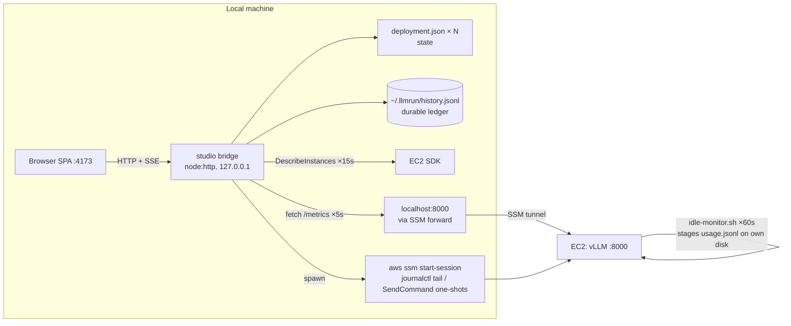

# Spec: llmrun Studio — dashboard, usage ledger, and chat

## Goal

A Docker-Desktop-style local web dashboard (`llmrun studio`) for running LLM instances: live
metrics (tokens/s, tokens in/out, requests, latency, cost), streaming logs, a ChatGPT-style chat
against the served model, and safe config updates — backed by a **durable, local-only usage
ledger** that survives `llmrun down`, so total stats exist regardless of whether a deployment is
still on the list.

Status: **proposed** — design doc, no code.

## Locked decisions

| Topic                 | Decision                                                                                                                                                                                                            | Rationale                                                                                                                               |
| --------------------- | ------------------------------------------------------------------------------------------------------------------------------------------------------------------------------------------------------------------- | --------------------------------------------------------------------------------------------------------------------------------------- |
| Form                  | Local web app: new `llmrun studio` command starts a Node bridge server (127.0.0.1 only) serving a static SPA + JSON/SSE API; opens browser                                                                          | Docker-Desktop analog needs real graphs; browser alone can't reach EC2 (no public IP), can't run `aws` CLI — the CLI must be the bridge |
| History storage       | **Local only**: append-only `~/.llmrun/history.jsonl`. No S3, CloudWatch, RDS, or any AWS service. The instance-side `usage.jsonl` is a _transient transport buffer_ — it dies with the instance, it is not storage | user decision; keeps privacy story ("data stays in your cloud") intact                                                                  |
| Cost model            | Estimates: running-hours × rate **+ storage-while-stopped** (EBS persists when stopped — currently invisible cost). No exact billing (Cost Explorer)                                                                | matches product positioning; `@aws-sdk/client-pricing` already a dep                                                                    |
| Identity              | `deploymentId = crypto.randomUUID()` minted per `up`, stored in `deployment.json`; aggregate by (model, instanceId)                                                                                                 | names are reusable after `down`; only id/instanceId are unique. No ulid dep needed                                                      |
| Bridge port           | default 4173, optional `studio_port` added to `~/.llmrun/config.json` schema                                                                                                                                        | distinct from `base_port: 8000` (model forwards)                                                                                        |
| UI stack              | Vite + React 19 + TS + Tailwind 4 (matches `docs/`), uPlot for time series, react-markdown for chat                                                                                                                 | reuses existing toolchain knowledge; no Next needed (static SPA)                                                                        |
| Bridge runtime deps   | none new: native `node:http` + SSE; minimal in-repo Prometheus text parser                                                                                                                                          | keep CLI dependency surface small                                                                                                       |
| Security              | bind 127.0.0.1 only; expose only `deploymentSchema` fields; **never surface the deployment workspace `tfvars` (contains `hf_token`)**                                                                               | same trust boundary as `curl` to the forwarded port                                                                                     |
| Ollama (CPU fallback) | degraded mode: no Prometheus on Ollama; show `/api/ps` basics only                                                                                                                                                  | vLLM is first-class                                                                                                                     |

## Foundation (why this is cheap)

- vLLM serves Prometheus `/metrics` on the **same port as the API** (`:8000` remote), and the
  SSM port-forward already puts it at `localhost:<localPort>` while connected. The bridge just
  fetches it — no CloudWatch, no new plumbing.
- `idle-monitor.sh` (in `terraform/modules/instance/templates/user-data.sh.tftpl`) already runs
  every 60s on the instance, already curls `/metrics`, and already diffs
  `vllm:request_success_total` against a prev-value file. It is the extension point for usage
  staging (~15 lines of bash).
- Every operation is already a plain function: `listDeployments`, `describeInstance`,
  `startInstance`/`stopInstance`, `isProcessAlive`, `estimateCost`, `establishPortForward`,
  `tailUnitLogs`. The bridge calls them directly.
- `removeDeployment()` does `rm -rf ~/.llmrun/deployments/<name>/` → the ledger must live outside
  that dir, and `down` must **flush before destroy**. This is what makes the ledger Phase 1, not
  a dashboard feature.

## Architecture



### Bridge endpoints (by phase)

| Endpoint                                      | Phase | Notes                                                                                                                      |
| --------------------------------------------- | ----- | -------------------------------------------------------------------------------------------------------------------------- |
| `GET /api/deployments`                        | 1     | state + live EC2 state (15s poll) + forward liveness + cost snapshot                                                       |
| `GET /api/deployments/:id/metrics` (SSE)      | 1     | server polls `localhost:<localPort>/metrics` every 5s (only while forwardPid alive), ring buffer in memory, push to client |
| `GET /api/deployments/:id/logs` (SSE)         | 1     | spawns `aws ssm start-session` interactive `journalctl -u llmrun-server -f -n 500`, pipes stdout                           |
| `POST /api/deployments/:id/actions`           | 1     | `{ action: stop \| start \| connect \| disconnect }` → reuses existing command logic                                       |
| `POST /api/deployments/:id/chat` (SSE)        | 2     | proxy to `/v1/chat/completions` (`stream: true`, `stream_options: { include_usage: true }`)                                |
| `GET/POST /api/deployments/:id/conversations` | 2     | chat CRUD over ledger `chat` events                                                                                        |
| `GET /api/history`                            | 2     | ledger aggregates (filter: model, since, id)                                                                               |
| `POST /api/deployments/:id/config`            | 3     | apply hot-applyable config via SSM                                                                                         |
| `GET /api/deployments/:id/gpu`                | 3     | reads `/var/lib/llmrun/gpu.json` via SendCommand                                                                           |

## Data model — usage ledger

**File**: `~/.llmrun/history.jsonl` (append-only, one JSON event per line; crash-safe, greppable;
aggregated in memory by studio/CLI on load). **Never deleted by `down`**; `llmrun history --clear`
is the only deletion path. Volume: ~150 B/line → <100 KB/day/deployment.

Events:

```jsonc
// deployment created
{ "t": "up",            "id": "<uuid>", "ts": "...", "name": "qwen-3.8-27B-awq", "alias": "...",
  "hfRepo": "cyankiwi/Qwen3.8-27B-AWQ-INT4", "instanceId": "i-0abc",
  "instanceType": "g6e.2xlarge", "engine": "vllm", "mode": "gpu", "region": "eu-central-1",
  "diskGb": 200, "contextLength": 200000, "quantization": null, "toolCallParser": "qwen3_xml",
  "usdPerHour": 2.242 }                 // snapshot at up (live-refreshed in phase 2/3)

// lifecycle transitions (reconciled from EC2 state)
{ "t": "instance_started",   "id": "<uuid>", "ts": "...", "source": "ec2" }
{ "t": "instance_stopped",   "id": "<uuid>", "ts": "...", "source": "ec2" }

// ingested instance usage buffer (deduped by ts; deltas vs previous snapshot)
{ "t": "usage_snapshot", "id": "<uuid>", "ts": "...", "runningSeconds": 7320,
  "activeSeconds": 5400, "promptTokens": 182340, "generationTokens": 96510,
  "requests": { "success": 142, "reset": 1 } }

// session closed (stopped/destroyed): computed totals
{ "t": "session_end", "id": "<uuid>", "ts": "...",
  "runningSeconds": ..., "activeSeconds": ..., "promptTokens": ..., "generationTokens": ...,
  "computeCostUsd": 4.58, "storageCostUsd": 0.02, "usdPer1MOutTokens": 0.48 }

// chat (phase 2)
{ "t": "chat", "id": "<uuid>", "ts": "...", "conversationId": "...",
  "messages": [ {"role": "user", "content": "..."}, {"role": "assistant", "content": "..."} ],
  "usage": { "promptTokens": 310, "completionTokens": 412 } }

// destroyed
{ "t": "down", "id": "<uuid>", "ts": "..." }
```

A **session** is one running window `[instance_started, instance_stopped]`; per-session token/cost
totals come from `usage_snapshot` diffs (with counter-reset handling) — so a destroyed deployment
leaves exactly one queryable record set.

### Instance-side staging (bash, in `user-data.sh.tftpl`)

Extend `idle-monitor.sh` (already 60s cadence, already curls `/metrics`):

- also parse `vllm:prompt_tokens_total` and `vllm:generation_tokens_total` (next to existing
  `request_success_total`)
- **counter reset detection**: if value < previous → close segment (add to cumulative), restart
  baseline. Required because `Restart=on-failure` + `ExecStartPre=docker rm -f` means every
  container start resets counters to 0
- accumulate `active` vs idle seconds using the existing `active` decision
- append a JSON line to `/var/lib/llmrun/usage.jsonl` every tick

### Flush (pull instance buffer → local ledger)

- New helper `pullInstanceUsage(sel, instanceId)`: SSM SDK `SendCommandCommand`
  (`AWS-RunShellScript`, `cat /var/lib/llmrun/usage.jsonl`) → `GetCommandInvocationCommand` →
  ingest new lines into ledger, dedup by `ts`, track last-ingested ts per deployment id.
  (SDK, not CLI shell-out — one-shot is cleaner; `ssmClient()` already exists in `lib/aws.ts`.)
- **Triggered on**: `up` (after healthy), `start`, `stop` (before stopping), `status`/`ls`
  (background, best-effort), and **`down` — as a precondition (one retry) before
  `removeDeployment`'s `rm -rf`**.
- Loss window: at most since the last CLI command. Buffer is KB-sized, so the pull is one cheap call.

### Reconciler (time/cost without a daemon)

Every lifecycle command already calls `DescribeInstances`; add a pass that diffs the last recorded
state per deployment and appends `instance_started`/`instance_stopped`. Extend `InstanceInfo` in
`lib/aws.ts` with `startTime` (ground truth). This yields exact running hours even if the laptop
was off the whole time, and no resident process is needed.

### Cost model

- `computeCost = Σ running-window × usdPerHour` (phase 1: table snapshot; phase 2/3: live via Pricing API)
- `storageCost = Σ stopped-window × $0.08/GB-month × diskGb` (gp3 baseline; EBS + model cache persist while stopped)
- `$ per 1M output tokens = sessionCost ÷ (generationTokens / 1e6)` — the headline KPI validating "pay for infrastructure, not tokens"
- efficiency = `activeSeconds / runningSeconds` — flags "instance burned money doing nothing", suggests shorter idle_timeout
- idle countdown (phase 2) = read `/var/lib/llmrun/last_active` via SendCommand + deployment `idleTimeout`

## Tabs (Docker-Desktop analog)

| Tab          | Content                                                                                                                                                                                                                                                                                                                                                                    |
| ------------ | -------------------------------------------------------------------------------------------------------------------------------------------------------------------------------------------------------------------------------------------------------------------------------------------------------------------------------------------------------------------------- |
| **Overview** | cards per deployment: state, endpoint, instance type, forward status, $/hr, uptime (EC2 StartTime), idle countdown (p2), actions: stop/start/connect/disconnect, copy-curl snippet                                                                                                                                                                                         |
| **Metrics**  | tokens/s line chart; tokens in vs out (segmented area); requests running/waiting/total; KV-cache usage; TTFT + time-per-output-token distributions; cost panel: session hours, $ so far, $/1M tokens; per-request latency on hover                                                                                                                                         |
| **Logs**     | streamed `journalctl -u llmrun-server` over SSM; filter box, pause/autoscroll, level coloring, `NRestarts` badge (makes OOM crash-looping obvious)                                                                                                                                                                                                                         |
| **Chat**     | ChatGPT-style: streaming markdown, stop button, per-message token/cost chip, params popover (temp, max_tokens, system prompt), conversation switcher (persisted in ledger, survives `down`), tool-call blocks (collapsible Qwen3-XML), lazy auto-connect on first message, one concurrent stream per deployment                                                            |
| **Config**   | effective config display; two buckets: **hot-apply** (idle_timeout → rewrite `idle-monitor.sh` on instance + `deployment.json`; context_length / quantization / tool_call_parser → regenerate `llmrun-server.service` + `daemon-reload` + restart) with diff preview + confirm; **needs re-provision** (instance_type, disk_gb, hf_repo) read-only with `llmrun.yaml` hint |
| **History**  | all deployments ever (running + destroyed): per-deployment sessions/tokens/cost, per-model aggregates, time-range filters, monthly totals, cost trend, $/1M tokens by model                                                                                                                                                                                                |

## Phase 1 — Ledger + studio core (monitoring)

The ledger is in phase 1 _because `down` is destructive_: without flush-first, the first
`llmrun down` destroys the data the dashboard is built on.

Scope:

1. **Ledger**: zod schema + append/aggregate in `src/lib/history.ts`; `deploymentId` added to
   `deploymentStateSchema`; instance staging (bash diff above); `pullInstanceUsage` (SSM SDK) +
   triggers incl. down-precondition; lifecycle reconciler; `InstanceInfo.startTime`.
2. **`llmrun studio` command** (`src/commands/studio.ts` + `src/studio/server.ts`): native
   `node:http` on 127.0.0.1:4173 (config), serves built SPA from `studio/assets`, endpoints
   `GET /api/deployments`, `.../metrics` (SSE, 5s poll, in-memory ring buffer), `.../logs` (SSE
   spawn), `.../actions`; opens browser (`--no-browser` to skip). Graceful Ctrl-C shutdown
   (kill spawned SSM children).
3. **Overview tab**: deployment cards + actions (reuse command functions), "not connected" state
   with Connect button (calls `establishPortForward`).
4. **Metrics tab** (vLLM): charts over the metrics below; stat cards ($/hr, $/1M tokens from
   ledger + live session). Ollama: "metrics unavailable on CPU/ollama" placeholder.
5. **Logs tab**: SSE stream, filter/autoscroll, restarts badge.

vLLM metric names consumed: `vllm:iteration_tokens_per_second` (gauge),
`vllm:prompt_tokens_total`, `vllm:generation_tokens_total`, `vllm:num_requests_running`,
`vllm:num_requests_waiting`, `vllm:gpu_cache_usage_perc` (KV cache, **not** VRAM),
`vllm:request_success_total`, `vllm:e2e_request_latency_seconds`,
`vllm:time_to_first_token_seconds`, `vllm:time_per_output_token_seconds` (histograms).

Acceptance:

- `llmrun studio` opens the dashboard; deployment card matches `llmrun ls`; stop/start/connect
  work from the UI.
- While running a test completion, tokens/s chart moves in real time; tokens in/out counters
  increase; logs stream live.
- `llmrun stop` then `llmrun down` → `history.jsonl` contains the full session (started,
  snapshots, ended, down) and the deployment dir is gone.
- Re-`up` same alias → new `deploymentId`, both records coexist in the ledger.
- Bridge refuses non-localhost bind; tfvars/hf_token never appear in any API response.

## Phase 2 — Chat + cost depth + history

Scope:

1. **Chat tab**: SSE proxy (`POST .../chat`, `stream_options: { include_usage: true }` —
   vLLM supports; required for token accounting), `AbortController` stop, markdown + code blocks,
   params popover, served-model picker from `GET /v1/models` (scales to future multi-model),
   conversations persisted as ledger `chat` events, per-message token + $-share chips, lazy
   auto-connect on first message, one active stream per deployment (reject extras), tool calls
   rendered as collapsible blocks (Qwen3-XML parser case).
2. **Cost engine**: live rates via `@aws-sdk/client-pricing` (refresh at `up` and in studio;
   replaces the stale-table caveat in `lib/instances.ts`), storage-while-stopped cost, session
   history view, $/1M tokens, idle countdown (`last_active` + idleTimeout via SendCommand),
   efficiency ratio with idle_timeout suggestion.
3. **History tab**: cross-ledger aggregates — per-deployment (incl. destroyed), per-model,
   time-range filters, monthly totals, cost trend, $/1M tokens by model.
4. **CLI parity** (same store, no studio needed): `llmrun cost [--since 30d] [--model <alias>]`,
   `llmrun history`, `llmrun history export <path>` (single-file zip — laptop-replacement
   escape hatch), `llmrun history --clear`.

Acceptance:

- Chat streams token-by-token; Stop aborts generation on the instance; usage lands in the ledger.
- Conversation text survives `down` and is visible in that deployment's chat history.
- Chatting in the UI extends the instance idle timer (emergent: `request_success_total` moves).
- `llmrun cost` totals match the dashboard; a 30-day view shows compute + stopped-storage split.
- Idle countdown reaches ~0 exactly when the instance self-stops.

## Phase 3 — Config control + GPU telemetry

Scope:

1. **Config tab**:
    - Hot-apply `idle_timeout`: rewrite `IDLE_SECONDS` in `/opt/llmrun/idle-monitor.sh` on the
      instance (SendCommand) + update `deployment.json`.
    - Hot-apply server flags (`context_length`, `quantization`, `tool_call_parser`): regenerate
      `llmrun-server.service` + `systemctl daemon-reload && systemctl restart llmrun-server`
      (SendCommand). The flag→`EXTRA_ARGS` logic (gpu-memory-utilization, max-model-len,
      tensor-parallel) must be a **single source of truth** shared between the user-data template
      and the CLI's unit generator — no drift.
    - Diff preview + confirm before any apply; re-provisioning fields shown read-only.
2. **GPU sidecar**: systemd timer (20s) in `user-data.sh.tftpl` running
   `nvidia-smi --query-gpu=utilization.gpu,memory.used,memory.total,temperature.gpu
--format=csv,noheader` → `/var/lib/llmrun/gpu.json`; bridge reads it via SendCommand; charts:
   VRAM used, utilization, temperature; CPU mode shows n/a.
3. **API-equivalent cost comparison**: small price table for popular hosted APIs; per-conversation
   "this chat: ~$0.06 on an API at $15/M vs $0.19 of your instance time".
4. **Polish**: multi-deployment aggregate view (total fleet cost/tokens), Ollama `/api/ps`
   basics card.

Acceptance:

- Changing idle_timeout in the UI is verifiable on the instance (`sed` result + timer behavior);
  changing context_length triggers a visible restart with new `--max-model-len` (logs +
  `docker inspect`).
- GPU charts show real VRAM/utilization values matching `nvidia-smi` in an SSM shell.
- A config apply failure (e.g. SSM blip) leaves the instance in its previous state (restart is
  last step; verify unit file written before restart).

## Out of scope (explicit)

- No AWS services for storage/metrics (local-only decision).
- No teams mode / multi-machine writers on the ledger (one machine per account is the honest
  constraint; if it ever breaks, that's the signal to revisit).
- When `plan.md`'s Phase-2 S3 **terraform state** backend lands, `~/.llmrun/history.jsonl` stays
  local — keep the two explicitly separate.
- No remote access / auth for the bridge (localhost trust boundary).
- Exact billing (Cost Explorer/Billing API) — estimates only.
- Bedrock in the studio (separate `plan.md` item).
- No public URL option for the dashboard.

## Risks & gotchas

- **SSE through the SSM tunnel is TCP** — long generations are fine, but the proxy must set
  generous/no idle timeouts and must not buffer the stream (pipe `ReadableStream` → response body
  directly). One `aws ssm start-session` child per open log tab/chat stream; close them on
  browser disconnect.
- **`down` contract**: flush (with retry) is a precondition of `removeDeployment`. Crash between
  flush and rm still preserves the deployment dir (safe direction).
- **Counter resets**: container restarts zero vLLM counters; reset detection in the instance
  monitor is mandatory for correct totals (pattern already exists for `request_success_total`).
- **Names are reusable** — never key history by deployment name; use `deploymentId`/instanceId.
- **`tfvars` contains `hf_token`** — the workspace dir must never be read by the bridge.
- **Ollama has no Prometheus** — degrade, don't fail.
- **`stream_options: { include_usage: true }`** is vLLM-specific; without it chat token
  accounting degrades to guessing.
- **Studio port collision** (4173 in use) — fail with a hint to set `studio_port`.
- Chat-as-activity is a _feature_ (keeps instance warm while conversing) — document it, don't "fix" it.
