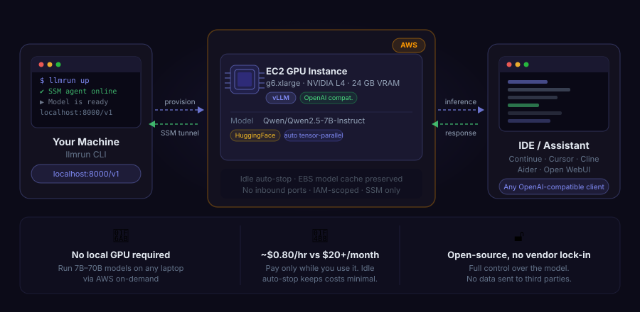

<p align="center">
  
</p>

<h1 align="center">llmrun</h1>

<p align="center">Work locally with deployed open-models in your cloud.</p>

<p align="center">
  <a href="https://www.npmjs.com/package/llmrun"></a>
  <a href="LICENSE"></a>
  <a href="https://nodejs.org"></a>
  <a href="https://www.terraform.io"></a>
</p>

<br />

<p align="center">
  
</p>

<br />

## Why llmrun?

- **No local GPU required** — your laptop stays cool. Models run on a right-sized AWS GPU instance you spin up on demand and let idle-stop when you're done.
- **Pay for infrastructure, not tokens** — no per-token pricing. You pay AWS on-demand rates (~$0.80/hr for a 7B model) only while the instance is running.
- **Your data stays in your cloud** — inference never leaves your AWS account. No third-party API sees your prompts, code, or documents — full isolation for sensitive or proprietary work.

## Install

```bash
npm install -g llmrun
# or
pnpm add -g llmrun
```

## Quick start

```bash
llmrun init      # scaffold llmrun.yaml
llmrun doctor    # check prerequisites
llmrun up        # pick a model → approve cost → provision → connect
```

Your model is now available at `http://localhost:8000/v1` — a full OpenAI-compatible endpoint.

## Docs

Full documentation at **[https://tomaszczechowski.github.io/llmrun](https://tomaszczechowski.github.io/llmrun)** — configuration, model catalog, coding assistant integrations, and command reference.

## License

Apache-2.0
